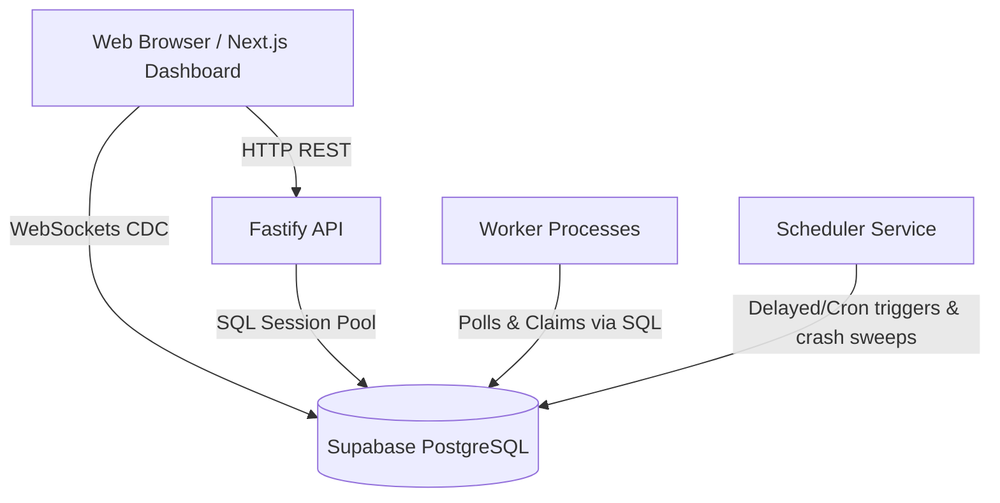

# System Architecture & Design

Lockstep is a Postgres-backed distributed job scheduler and task queue system designed for multi-tenant SaaS environments. It relies on PostgreSQL for persistence, state tracking, and concurrency management, avoiding the need for external caching/queueing infrastructure like Redis or RabbitMQ.

## Core Component Split

The system is separated into three stateless application services and a centralized relational database:

### 1. Fastify REST API (`backend/apps/api`)
* **Role**: Serves REST endpoints for system administration, job queue configuration, job creation, cancelling/retrying jobs, and operational metrics.
* **Authentication**: Decodes and verifies JWTs signed by Supabase Auth (GoTrue).
* **Multi-tenant Isolation**: Enforces tenant authorization at the query level by matching the decoded `user_id` from the JWT with organization and project ownership configurations before returning or mutating resource data.

### 2. Worker Daemon (`backend/apps/worker`)
* **Role**: Runs polling loops that claim and execute jobs concurrently using a promise queue (`p-limit`).
* **State Machine**: Transitions jobs from `queued`/`scheduled` to `claimed` -> `running` -> `completed` / `failed` / `dead_letter`.
* **Heartbeats**: Regularly writes liveness probes to the `worker_heartbeats` table and updates worker metadata status.
* **Graceful Shutdown**: Intercepts `SIGINT` and `SIGTERM` signals to flag the worker status as `draining`, stops accepting new claims, and allows active job executions to drain safely for up to 30 seconds before termination.

### 3. Scheduler Daemon (`backend/apps/scheduler`)
* **Role**: A background singleton service that handles cron scheduling, delayed job dispatching, and stale worker recovery.
* **Cron & Delayed Execution**: Periodically checks the `scheduled_jobs` table to evaluate cron schedules using `cron-parser`, inserting new job runs and updating `next_run_at` timestamps. Also moves due delayed/scheduled jobs (`scheduled_at <= now()`) into the `queued` state.
* **Worker Crash Recovery**: Sweeps the active workers table for instances whose last heartbeat is older than 30 seconds. It flags them as `offline` and automatically aborts their open `job_executions` (marking them `failed`) and resets their orphaned jobs back to `queued` for other workers to pick up.

### 4. PostgreSQL Database (`Supabase`)
* **Role**: Serves as the single source of truth, operational ledger, and synchronization layer.
* **Concurrency Locking**: Employs row-level pessimistic locking (`FOR UPDATE SKIP LOCKED`) for concurrent job claims.
* **Isolation Levels**: Implements `SERIALIZABLE` transaction isolation in the `claimJobs` step to guarantee queue concurrency limits are strictly enforced without race conditions across concurrent workers.

---

## Concurrency & Execution Flow

### Polling Mechanics
Workers execute a continuous polling loop (defaulting to a `1000ms` sleep interval between iterations). 
To claim jobs, a worker:
1. Calculates remaining capacity space in its queue subscription based on its local worker capacity and the queue's global concurrency limit.
2. If slots are available, executes `claimJobs` in a transaction.

### Serializable Queue Capacity Enforcing
To prevent multiple workers from over-claiming jobs past a queue's `concurrency_limit` under high load:
* The transaction setting is explicitly set to `SERIALIZABLE` isolation before the query.
* A capacity subquery computes the active running job count (`claimed` or `running` status) and subtracts it from `concurrency_limit` to obtain the remaining available slot budget.
* Candidate jobs are locked using `FOR UPDATE OF jobs SKIP LOCKED` up to the calculated limit.
* In case of concurrent transaction conflicts on the capacity count, PostgreSQL raises a serialization conflict error (`40001`). The worker catches this exception, performs a randomized backoff (10–50ms) to avoid lock contention, and retries the transaction (up to 5 attempts).

### Workflow Dependency Resolution
Workflow dependencies are enforced atomically at claim time. When a worker selects jobs for execution, a `NOT EXISTS` condition ensures that no jobs are claimed if they depend on predecessor jobs that have not reached the `completed` state.
