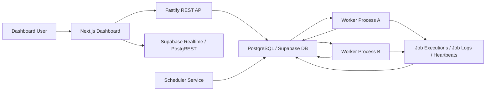
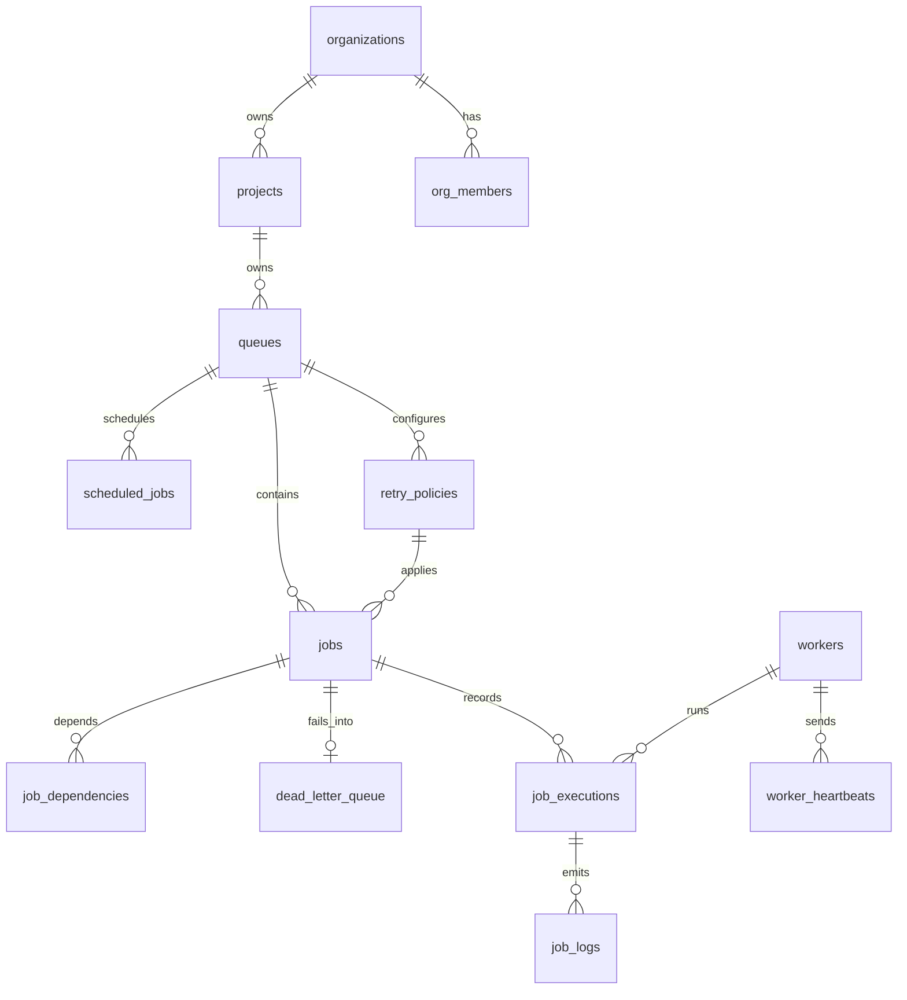

# Lockstep Assignment Audit Report

Audit date: 2026-07-02  
Project: Distributed Job Scheduler

## Executive Summary

Lockstep is now in a much stronger delivery state than the initial audit. The core architecture is appropriate for the assignment: Fastify REST API, PostgreSQL/Supabase persistence, Drizzle schema, worker polling with `FOR UPDATE SKIP LOCKED`, scheduler process, retry policies, DLQ, and a Next.js dashboard.

Before fixes, the project was not submission-ready: API source did not typecheck, frontend lint/build failed, DLQ and metrics were anonymously accessible, queue creation used a hardcoded fake project ID, job logs were mocked, and the scheduler had a broken import. Those issues have been repaired.

Current readiness: good for demo and review if a valid `DATABASE_URL`/Supabase environment is available. The main remaining blocker is integration test execution against the configured hosted database, which currently fails DNS resolution for `db.xhaatqmfvirajddgzdkp.supabase.co` from this machine.

## Verification Results

| Check | Result | Notes |
|---|---:|---|
| Backend source typecheck | Pass | `pnpm exec tsc --noEmit -p tsconfig.json` from `backend` |
| Frontend lint | Pass | `pnpm run lint` from `frontend` |
| Frontend production build | Pass | `pnpm run build` from `frontend` |
| Worker unit tests | Pass | 8 tests: retry, FSM, graceful shutdown |
| Worker full integration tests | Blocked/Fail | DB hostname `db.xhaatqmfvirajddgzdkp.supabase.co` cannot resolve |

## Architecture Diagram

## ER Diagram

## Requirement Coverage

| Requirement | Status | Evidence / Notes |
|---|---:|---|
| Authentication | Partial | JWT middleware exists and now protects metrics/DLQ too. Local mock login is useful for demo. Needs production Supabase session flow and stronger authorization checks on every resource. |
| Project management | Partial | Org/project create/list APIs exist. Dashboard bootstraps a default org/project. Needs full project switcher and member management UX. |
| Multiple queues per project | Done | Schema and API support project-scoped queues. |
| Queue configuration | Partial | Priority, concurrency limit, pause/resume, default retry policy supported. Needs edit queue config UI/API and stronger validation bounds. |
| Queue statistics | Partial | Queue stats and global metrics exist. Needs richer throughput, latency percentiles, depth by status. |
| Immediate jobs | Done | `POST /queues/:queueId/jobs` supports immediate jobs. |
| Delayed jobs | Done | `delay_ms` creates scheduled job state with future `scheduled_at`. |
| Scheduled one-time jobs | Done | Added `scheduled_at` support for `type: scheduled`. |
| Recurring cron jobs | Done | `scheduled_jobs` table and scheduler service exist. |
| Batch jobs | Partial | Batch insert with `batch_id` exists. Needs batch status aggregation and UI. |
| Worker polling | Done | Worker polls active queues and claims jobs. |
| Atomic claims | Done | Uses `SELECT ... FOR UPDATE SKIP LOCKED`. Patched to return correct DB result shape. |
| Global queue concurrency | Improved | Claim SQL now checks active claimed/running jobs against queue concurrency limit. |
| Concurrent execution | Done | Worker uses `p-limit`. |
| Heartbeats | Done | Worker inserts heartbeat rows and updates worker status. |
| Graceful shutdown | Improved | Handles both `SIGTERM` and `SIGINT`. |
| Lifecycle states | Done | FSM validates transitions; worker uses queued/scheduled -> claimed -> running -> completed/dead_letter. |
| Retries | Done | Fixed, linear, exponential backoff implemented and unit tested. |
| Dead Letter Queue | Done | Failed terminal jobs move to DLQ and can be requeued/deleted. |
| Execution logs | Improved | Worker now writes real job logs for claim/start/retry/DLQ/completion. |
| Retry history | Partial | Attempt count and executions exist. Needs dedicated retry history view and reason per attempt in UI. |
| Worker assignment | Done | `claimed_by`, executions, workers tables capture assignment. |
| Execution metrics | Partial | Durations are now stored. Needs percentiles and per-queue/per-worker dashboards. |
| Dashboard queue management | Partial | Queue list, create, pause/resume, dispatch jobs. Needs edit retry policy and project switcher. |
| Job explorer | Partial | Lists jobs and lifecycle. Needs API-backed filters, logs panel, retry/cancel actions. |
| Worker monitor | Partial | Worker cards. Needs heartbeat freshness and stale/offline detection. |
| DLQ management | Done | UI supports requeue/delete. |
| Live updates | Partial | Jobs/workers use Supabase realtime; queues now poll API. |

## Fixes Completed During Audit

- Fixed API compile error from duplicated `drizzle-orm` import.
- Added backend workspace `tsconfig.json`.
- Added missing backend dependency declarations for `drizzle-orm`, `postgres`, Node types, and UUID types.
- Added authenticated API methods for metrics, orgs, projects, and project queues.
- Removed anonymous access exemption for `/metrics` and `/dlq`.
- Added one-time scheduled job support with `scheduled_at`.
- Added job list/filter/pagination endpoint.
- Added job cancel endpoint for queued/scheduled jobs.
- Replaced mock job logs endpoint with real `job_logs` query.
- Added project queue listing endpoint.
- Added org project listing endpoint.
- Fixed metrics route result parsing for the current Drizzle/Postgres client.
- Fixed worker claim result parsing.
- Strengthened claim SQL to respect queue concurrency globally.
- Added worker execution logs and duration metrics.
- Added `SIGINT` graceful shutdown handling.
- Fixed scheduler broken import and cron next-run calculation.
- Removed a mutating DLQ repair script from the normal test suite.
- Reworked queue dashboard creation flow to avoid fake project IDs.
- Fixed frontend lint/type issues and React purity issues.
- Added explicit Next.js Turbopack root.

## API Documentation Summary

Core endpoints:

| Method | Endpoint | Purpose |
|---|---|---|
| `POST` | `/auth/login` | Local demo JWT |
| `POST` | `/orgs` | Create organization |
| `GET` | `/orgs` | List user organizations |
| `POST` | `/orgs/:orgId/projects` | Create project |
| `GET` | `/orgs/:orgId/projects` | List projects |
| `POST` | `/projects/:projectId/queues` | Create queue with optional retry policy |
| `GET` | `/projects/:projectId/queues` | List project queues |
| `GET` | `/queues/:queueId` | Queue details |
| `GET` | `/queues/:queueId/stats` | Queue stats |
| `POST` | `/queues/:queueId/pause` | Pause queue |
| `POST` | `/queues/:queueId/resume` | Resume queue |
| `POST` | `/queues/:queueId/jobs` | Create immediate, delayed, scheduled, or batch job |
| `POST` | `/queues/:queueId/jobs/recurring` | Create cron recurring schedule |
| `GET` | `/jobs` | List/filter jobs |
| `GET` | `/jobs/:jobId` | Job detail with executions |
| `GET` | `/jobs/:jobId/logs` | Real execution logs |
| `POST` | `/jobs/:jobId/cancel` | Cancel queued/scheduled job |
| `GET` | `/dlq` | List DLQ entries |
| `GET` | `/queues/:queueId/dlq` | Queue-specific DLQ |
| `POST` | `/dlq/:dlqId/requeue` | Requeue failed job |
| `DELETE` | `/dlq/:dlqId` | Delete DLQ entry |
| `GET` | `/metrics` | Dashboard metrics |

## Database Design Assessment

Strengths:

- Normalized multi-tenant hierarchy: organizations -> projects -> queues -> jobs.
- Good use of append-only `job_executions` for attempts.
- DLQ separated from primary job table while retaining FK to job.
- Indexes exist for claim path, queue/status listing, scheduled jobs, and heartbeats.
- Cascades are mostly sensible: deleting org/project/queue deletes owned operational data.
- Idempotency key unique index exists per queue.

Concerns:

- `idx_jobs_idempotency` is unique on nullable `idempotency_key`; PostgreSQL permits multiple nulls, which is fine, but document that behavior.
- `default_retry_policy_id` is not declared as an FK in schema; add explicit FK if possible.
- `parent_job_id` is not declared as a self-FK.
- Queue counters (`total_jobs`, `failed_jobs`, `completed_jobs`) can drift unless maintained by triggers or replaced with derived stats.
- RLS claims exist in README, but should be verified against actual hosted DB.
- Worker stale detection should be implemented from `worker_heartbeats`.

## Reliability And Concurrency Assessment

Good:

- Atomic claiming uses `FOR UPDATE SKIP LOCKED`.
- Worker heartbeat and status model exists.
- Retry delay strategies are unit-tested.
- DLQ flow exists and is actionable from UI.
- Graceful shutdown drains active jobs.

Needs improvement:

- Integration tests require a reachable test database or local Docker profile.
- Worker job handlers are demo-only (`sleep_simulate`, `fail_simulate`). A production-inspired submission should document a handler plugin/registry contract.
- No stale claimed-job recovery yet. Add a sweeper to reschedule jobs whose worker heartbeat expired.
- Idempotency is only at insert level; handlers should receive idempotency guidance.
- Queue concurrency is now guarded at claim time, but high-concurrency stress tests should be added.

## UX Assessment

Good:

- Dashboard covers metrics, queues, jobs, workers, and DLQ.
- UI is responsive and production build passes.
- Queue creation and job dispatch are now usable without hardcoded fake IDs.
- DLQ requeue/delete actions are clear.

Needs improvement:

- Add visible loading/error states instead of `alert`.
- Add project/org switcher backed by real API data.
- Add job log panel inside job detail.
- Add job filtering by queue/status/type/date.
- Add queue configuration edit view for concurrency/retry policy.
- Add worker heartbeat freshness indicator.
- Add batch job details and progress aggregation.

## Estimated Rubric Score

| Category | Max | Estimated | Rationale |
|---|---:|---:|---|
| System Architecture | 20 | 16 | Good service split and correct DB-centered architecture; needs stale recovery and clearer local env story. |
| Database Design | 20 | 16 | Strong schema and indexes; a few missing FKs/counter consistency concerns. |
| Backend Engineering | 20 | 15 | REST APIs, validation, auth, worker logic improved; authorization and full integration tests need work. |
| Reliability & Concurrency | 15 | 11 | Atomic claim and retry/DLQ exist; needs stale job recovery and verified integration stress tests. |
| Frontend & UX | 10 | 7 | Functional dashboard builds; needs richer management flows and polished loading/error states. |
| API Design | 5 | 4 | Clean REST shape; needs OpenAPI/Swagger and complete authorization consistency. |
| Documentation | 5 | 4 | README plus this audit; add dedicated setup/API/design docs. |
| Testing | 5 | 3 | Unit tests pass; integration tests blocked by DB DNS/env. |
| Total | 100 | 76 | Good submission candidate after DB environment/test verification and docs polish. |

## Highest-Priority Remaining Work

1. Provide a reliable local Postgres/Supabase test setup and make integration tests pass without hosted DNS dependency.
2. Add stale worker/job recovery: detect missed heartbeats and requeue timed-out claimed/running jobs safely.
3. Add resource-level authorization checks for every queue/job/DLQ endpoint.
4. Add OpenAPI documentation with request/response examples.
5. Add job detail log viewer and retry/cancel controls in the dashboard.
6. Add queue edit UI/API for retry policy, priority, and concurrency.
7. Add complete setup instructions with required `.env` examples.

## Final Delivery Recommendation

Do not submit without a working database environment and one clean full integration run. Once that is fixed, this project is credible for the assignment: it demonstrates database design, concurrency control, lifecycle handling, retries, DLQ, observability, and a usable dashboard. The strongest additions before final submission would be stale job recovery, authorization hardening, and API/design docs.
