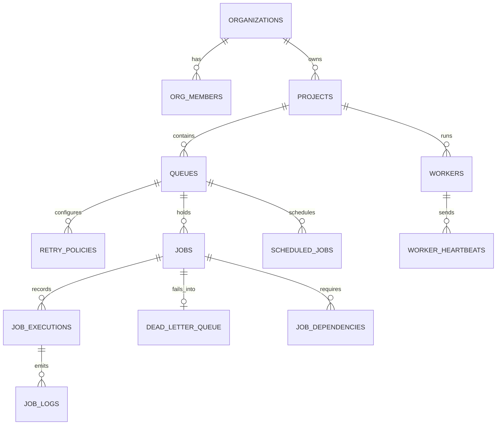

# Database Schema & Triggers

The database is built on PostgreSQL and mapped using Drizzle ORM.

## Entity-Relationship (ER) Diagram



---

## Postgres Enums

1. **`queue_status`**: `active`, `paused`
2. **`retry_strategy`**: `fixed`, `linear`, `exponential`
3. **`job_type`**: `immediate`, `delayed`, `scheduled`, `recurring`, `batch`
4. **`job_status`**: `queued`, `scheduled`, `claimed`, `running`, `completed`, `failed`, `dead_letter`, `cancelled`
5. **`worker_status`**: `idle`, `busy`, `draining`, `offline`
6. **`execution_status`**: `started`, `completed`, `failed`
7. **`log_level`**: `info`, `warn`, `error`

---

## Tables

### 1. `organizations`
* Central tenant scope.
* Columns:
  * `id` (`uuid`, Primary Key, Defaults to `gen_random_uuid()`)
  * `name` (`text`, Not Null)
  * `created_at` (`timestamp with time zone`, Not Null, Defaults to `now()`)

### 2. `org_members`
* Maps users to organizations.
* Columns:
  * `org_id` (`uuid`, Not Null, Foreign Key to `organizations.id` with `onDelete: 'cascade'`)
  * `user_id` (`uuid`, Not Null) - Checked and authenticated at application layer using Supabase Auth JWTs.
  * `role` (`text`, Not Null, Defaults to `'member'`) - Options: `owner`, `admin`, `member`.
* Constraints:
  * Composite Primary Key: `(org_id, user_id)`

### 3. `projects`
* Organizational grouping for queues.
* Columns:
  * `id` (`uuid`, Primary Key, Defaults to `gen_random_uuid()`)
  * `org_id` (`uuid`, Not Null, Foreign Key to `organizations.id` with `onDelete: 'cascade'`)
  * `name` (`text`, Not Null)
  * `created_at` (`timestamp with time zone`, Not Null, Defaults to `now()`)

### 4. `queues`
* Execution boundaries containing scheduling preferences.
* Columns:
  * `id` (`uuid`, Primary Key, Defaults to `gen_random_uuid()`)
  * `project_id` (`uuid`, Not Null, Foreign Key to `projects.id` with `onDelete: 'cascade'`)
  * `name` (`text`, Not Null)
  * `priority` (`integer`, Not Null, Defaults to `10`)
  * `concurrency_limit` (`integer`, Not Null, Defaults to `10`)
  * `status` (`queue_status`, Not Null, Defaults to `'active'`)
  * `default_retry_policy_id` (`uuid`, Foreign Key to `retry_policies.id` with `onDelete: 'set null'`)
  * `total_jobs` (`integer`, Not Null, Defaults to `0`)
  * `failed_jobs` (`integer`, Not Null, Defaults to `0`)
  * `completed_jobs` (`integer`, Not Null, Defaults to `0`)
  * `created_at` (`timestamp with time zone`, Not Null, Defaults to `now()`)

### 5. `retry_policies`
* Backoff strategies configured per queue.
* Columns:
  * `id` (`uuid`, Primary Key, Defaults to `gen_random_uuid()`)
  * `queue_id` (`uuid`, Foreign Key to `queues.id` with `onDelete: 'cascade'`)
  * `strategy` (`retry_strategy`, Not Null)
  * `base_delay_ms` (`integer`, Not Null)
  * `max_delay_ms` (`integer`)
  * `multiplier` (`integer`) - Used for exponential backoff math.
  * `max_attempts` (`integer`, Not Null)

### 6. `workers`
* Node processes pulling work.
* Columns:
  * `id` (`uuid`, Primary Key, Defaults to `gen_random_uuid()`)
  * `project_id` (`uuid`, Foreign Key to `projects.id` with `onDelete: 'cascade'`)
  * `hostname` (`text`, Not Null)
  * `status` (`worker_status`, Not Null, Defaults to `'idle'`)
  * `capacity` (`integer`, Not Null)
  * `subscribed_queues` (`uuid[]` array of subscribed queue IDs)
  * `version` (`text`)
  * `started_at` (`timestamp with time zone`, Not Null, Defaults to `now()`)
* Indexes:
  * Unique Index `idx_workers_hostname` on `hostname`

### 7. `jobs`
* Operational state machine tasks.
* Columns:
  * `id` (`uuid`, Primary Key, Defaults to `gen_random_uuid()`)
  * `queue_id` (`uuid`, Not Null, Foreign Key to `queues.id` with `onDelete: 'cascade'`)
  * `retry_policy_id` (`uuid`, Foreign Key to `retry_policies.id` with `onDelete: 'set null'`)
  * `parent_job_id` (`uuid`, Foreign Key to `jobs.id` with `onDelete: 'set null'`) - Used for task dependencies.
  * `type` (`job_type`, Not Null)
  * `status` (`job_status`, Not Null, Defaults to `'queued'`)
  * `priority` (`integer`, Not Null, Defaults to `10`)
  * `payload` (`jsonb`, Not Null, Defaults to `{}`)
  * `idempotency_key` (`text`) - Restricts duplicate insertion within a queue.
  * `scheduled_at` (`timestamp with time zone`, Not Null, Defaults to `now()`)
  * `claimed_by` (`uuid`, Foreign Key to `workers.id` with `onDelete: 'set null'`)
  * `claimed_at` (`timestamp with time zone`)
  * `attempt` (`integer`, Not Null, Defaults to `0`)
  * `batch_id` (`uuid`)
  * `created_at` (`timestamp with time zone`, Not Null, Defaults to `now()`)
* Indexes:
  * Index `idx_jobs_claim` on `(queue_id, status, priority, scheduled_at)` - Powers the `SKIP LOCKED` selector.
  * Unique Index `idx_jobs_idempotency` on `(queue_id, idempotency_key)`
  * Index `idx_jobs_queue_status` on `(queue_id, status, created_at)`

### 8. `job_executions`
* Historical records of execution attempts.
* Columns:
  * `id` (`uuid`, Primary Key, Defaults to `gen_random_uuid()`)
  * `job_id` (`uuid`, Not Null, Foreign Key to `jobs.id` with `onDelete: 'cascade'`)
  * `worker_id` (`uuid`, Foreign Key to `workers.id` with `onDelete: 'set null'`)
  * `started_at` (`timestamp with time zone`, Not Null, Defaults to `now()`)
  * `finished_at` (`timestamp with time zone`)
  * `status` (`execution_status`, Not Null)
  * `result` (`jsonb`)
  * `error` (`jsonb`)
  * `duration_ms` (`integer`)
* Indexes:
  * Index `idx_executions_job` on `(job_id, started_at)`

### 9. `job_logs`
* Raw execution logs.
* Columns:
  * `id` (`bigserial`, Primary Key)
  * `execution_id` (`uuid`, Not Null, Foreign Key to `job_executions.id` with `onDelete: 'cascade'`)
  * `ts` (`timestamp with time zone`, Not Null, Defaults to `now()`)
  * `level` (`log_level`, Not Null)
  * `message` (`text`, Not Null)

### 10. `scheduled_jobs`
* Definition templates for recurring cron routines.
* Columns:
  * `id` (`uuid`, Primary Key, Defaults to `gen_random_uuid()`)
  * `queue_id` (`uuid`, Not Null, Foreign Key to `queues.id` with `onDelete: 'cascade'`)
  * `cron_expression` (`text`, Not Null)
  * `timezone` (`text`, Not Null, Defaults to `'UTC'`)
  * `job_template` (`jsonb`, Not Null)
  * `next_run_at` (`timestamp with time zone`, Not Null)
  * `last_run_at` (`timestamp with time zone`)
  * `enabled` (`boolean`, Not Null, Defaults to `true`)
* Indexes:
  * Index `idx_scheduled_next_run` on `(next_run_at)`

### 11. `dead_letter_queue`
* Failed jobs exceeding retry thresholds.
* Columns:
  * `id` (`uuid`, Primary Key, Defaults to `gen_random_uuid()`)
  * `job_id` (`uuid`, Not Null, Unique, Foreign Key to `jobs.id` with `onDelete: 'cascade'`)
  * `failure_reason` (`text`, Not Null)
  * `attempts_made` (`integer`, Not Null)
  * `original_payload` (`jsonb`, Not Null)
  * `moved_at` (`timestamp with time zone`, Not Null, Defaults to `now()`)
  * `resolved` (`boolean`, Not Null, Defaults to `false`)
  * `resolved_by` (`uuid`)

### 12. `worker_heartbeats`
* Health telemetry for active workers.
* Columns:
  * `id` (`bigserial`, Primary Key)
  * `worker_id` (`uuid`, Not Null, Foreign Key to `workers.id` with `onDelete: 'cascade'`)
  * `ts` (`timestamp with time zone`, Not Null, Defaults to `now()`)
  * `active_job_count` (`integer`, Not Null)
  * `cpu_pct` (`integer`)
  * `mem_mb` (`integer`)
* Indexes:
  * Index `idx_heartbeats_worker_ts` on `(worker_id, ts)`

### 13. `job_dependencies`
* Tracks task prerequisites.
* Columns:
  * `job_id` (`uuid`, Not Null, Foreign Key to `jobs.id` with `onDelete: 'cascade'`)
  * `depends_on_job_id` (`uuid`, Not Null, Foreign Key to `jobs.id` with `onDelete: 'cascade'`)
* Constraints:
  * Composite Primary Key: `(job_id, depends_on_job_id)`

---

## Custom Database Triggers & Functions

A set of database triggers are installed (`packages/db/apply_custom_sql.js`) to maintain queue counter aggregates:

```sql
CREATE OR REPLACE FUNCTION update_queue_counters()
RETURNS TRIGGER AS $$
BEGIN
  IF TG_OP = 'INSERT' THEN
    UPDATE queues SET total_jobs = total_jobs + 1 WHERE id = NEW.queue_id;
  ELSIF TG_OP = 'UPDATE' THEN
    IF OLD.status IS DISTINCT FROM NEW.status THEN
      IF NEW.status = 'completed' THEN
        UPDATE queues SET completed_jobs = completed_jobs + 1 WHERE id = NEW.queue_id;
      ELSIF NEW.status = 'failed' OR NEW.status = 'dead_letter' THEN
        IF OLD.status != 'failed' AND OLD.status != 'dead_letter' THEN
          UPDATE queues SET failed_jobs = failed_jobs + 1 WHERE id = NEW.queue_id;
        END IF;
      END IF;
      
      IF OLD.status = 'completed' AND NEW.status != 'completed' THEN
         UPDATE queues SET completed_jobs = completed_jobs - 1 WHERE id = NEW.queue_id;
      END IF;
      
      IF (OLD.status = 'failed' OR OLD.status = 'dead_letter') AND (NEW.status != 'failed' AND NEW.status != 'dead_letter') THEN
         UPDATE queues SET failed_jobs = failed_jobs - 1 WHERE id = NEW.queue_id;
      END IF;
    END IF;
  ELSIF TG_OP = 'DELETE' THEN
    UPDATE queues SET total_jobs = total_jobs - 1 WHERE id = OLD.queue_id;
    IF OLD.status = 'completed' THEN
      UPDATE queues SET completed_jobs = completed_jobs - 1 WHERE id = OLD.queue_id;
    ELSIF OLD.status = 'failed' OR OLD.status = 'dead_letter' THEN
      UPDATE queues SET failed_jobs = failed_jobs - 1 WHERE id = OLD.queue_id;
    END IF;
  END IF;
  RETURN NULL;
END;
$$ LANGUAGE plpgsql;

CREATE TRIGGER trg_queue_counters
AFTER INSERT OR UPDATE OR DELETE ON jobs
FOR EACH ROW
EXECUTE FUNCTION update_queue_counters();
```

---

## Row Level Security (RLS)

RLS policies are enforced on the core tables to maintain tenant scoping:
1. **`organizations`**: Select allowed if a matching user record exists in `org_members` matching `auth.uid()`.
2. **`projects`**: Select allowed if org ownership correlates with the member's profile matching `auth.uid()`.
3. **`queues`**: Select allowed if the project's org matches member organizations containing `auth.uid()`.
4. **`jobs`**: Select allowed if the queue's project's org matches member organizations containing `auth.uid()`.
